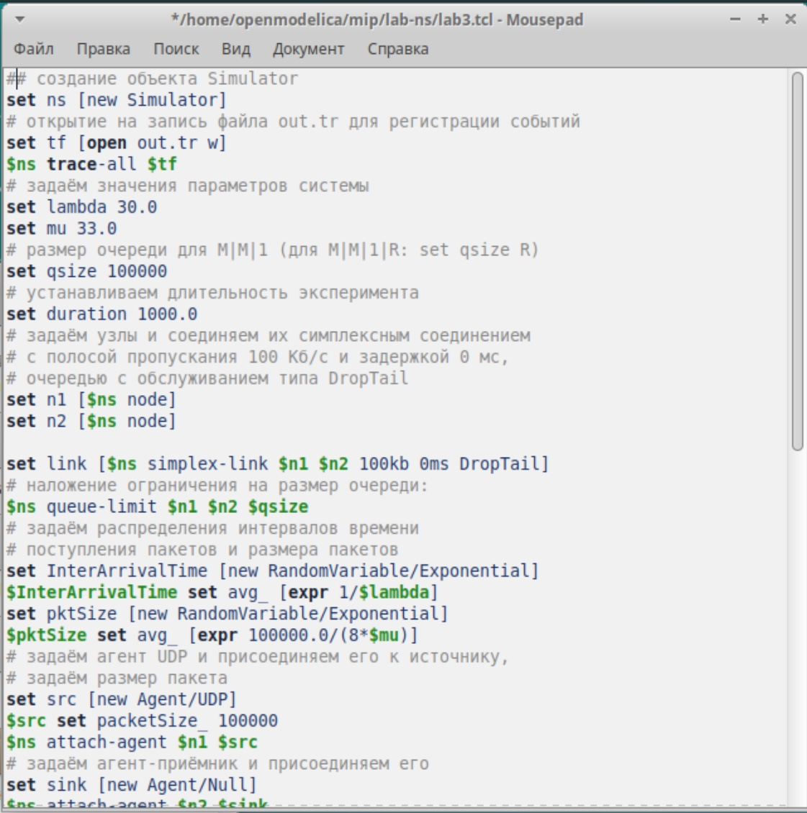
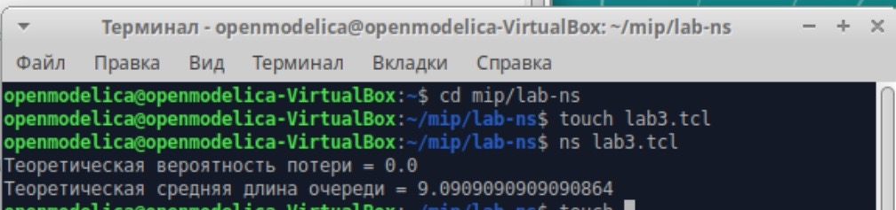
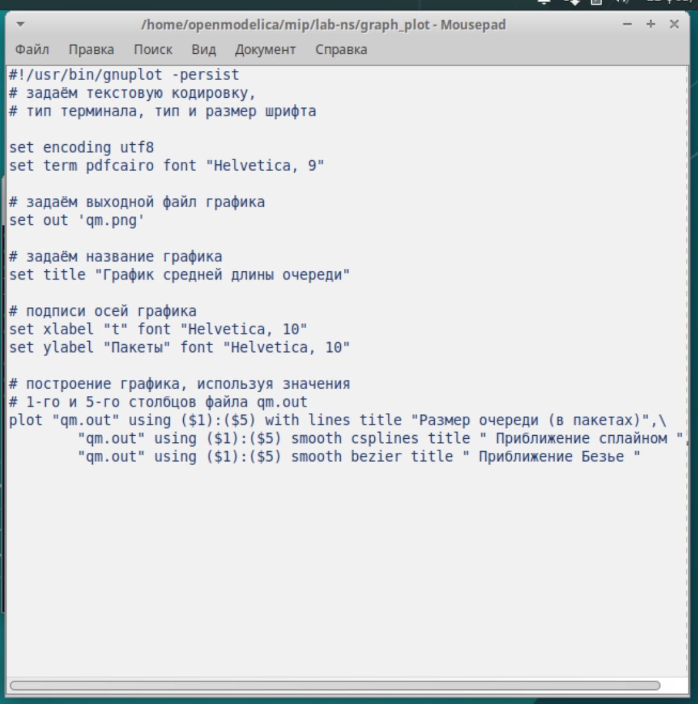
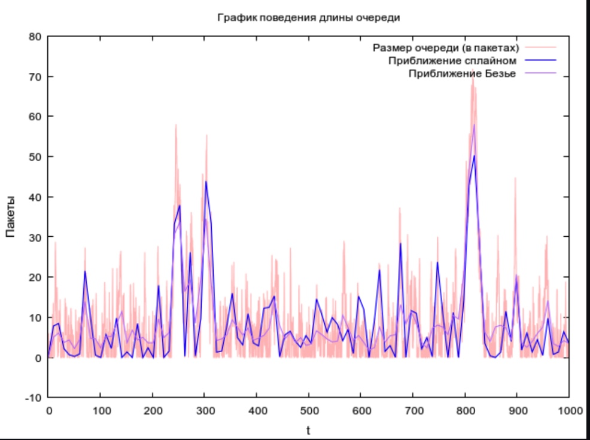

---
## Front matter
lang: ru-RU
title: Лабораторная работа №3
subtitle: Моделирование стохастических процессов
author:
  - Оширова Юлия Николаевна
institute:
  - Российский университет дружбы народов, Москва, Россия
date: 22 февраля 2025

## i18n babel
babel-lang: russian
babel-otherlangs: english

## Formatting pdf
toc: false
toc-title: Содержание
slide_level: 2
aspectratio: 169
section-titles: true
theme: metropolis
header-includes:
 - \metroset{progressbar=frametitle,sectionpage=progressbar,numbering=fraction}
---

# Информация

## Докладчик

  * Оширова Юлия Николаевна
  * студентка группы НФИбд-01-22
  * Российский университет дружбы народов

# Цель работы

Провести моделирование системы массового обслуживания (СМО).

# Задание

1) Реализовать модель M|M|1;
2) Посчитать загрузку системы и вероятность потери пакетов;
3) Построить график изменения размера очереди

# Выполнение лабораторной работы

M|M|1 - это однолинейная СМО с накопителем бесконечной ёмкости. Поступающий поток заявок — пуассоновский с интенсивностью λ. Времена обслуживания заявок — независимые в совокупности случайные величины, распределённые по экспоненциальному закону с параметром μ. Реализуем эту систему. Зададим параметры системы λ = 30, μ = 33,  размер очереди 100000, длительность эксперимента 100000. Далее задаем узлы, между которыми будут идти пакеты, и соединяем их симплексным соединением с полосой пропускания 100 Кб/с и задержкой 0 мс, очередью с обслуживанием типа DropTail. Наложим ограничения на размер очереди. Источником трафика ставим UDP-агент, приемником Null-агент. Также осуществим мониторинг очереди. Процедура finish закрывает файлы трассировки. Процедура sendpack -- случайно генерирует пакеты по экспоненциальному распределению. Также в данной сценарии рассчитывается по формулам загрузка система и вероятность потери пакетов. (рис. [-@fig:001])

## Выполнение задания
{#fig:001 width=70%}

## Итог
Запустив эту программу, получим значения загрузки системы и вероятности потери пакетов (рис. [-@fig:002]).

{#fig:002 width=70%}

## Следующее задание
В каталоге с проектом создадим отдельный файл, например, graph_plot, touch graph_plot. Откроем его на редактирование и добавим следующий код, обращая внимание на синтаксис GNUplot (рис. [-@fig:003]).

{#fig:003 width=70%}

## Файл должен быть исполняемым
Сделаем файл исполняемым. После компиляции файла с проектом, запустим скрипт в созданном файле graph_plot (рис. [-@fig:004]), который создаст файл qm.png с результатами моделирования (рис. [-@fig:005]).

{#fig:004 width=70%}

## Итог
{#fig:005 width=70%}

На данном графике изображен размер очереди в пакетах, а также его приближение сплайном и Безье.

# Выводы

В процессе выполнения данной лабораторной работы я провела моделирование системы массового обслуживания (СМО).

