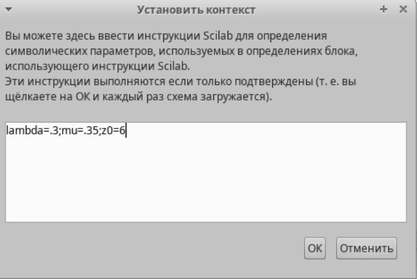
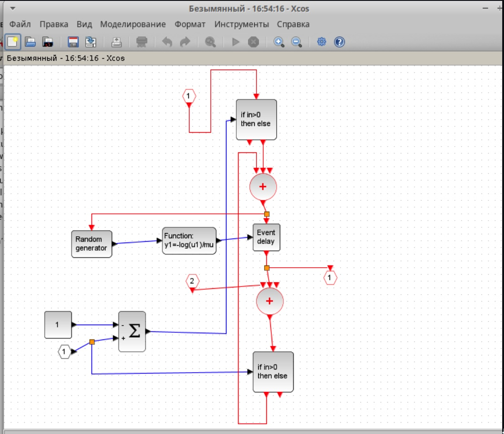
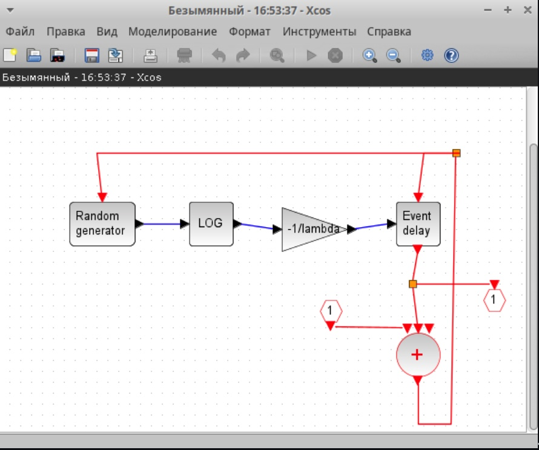
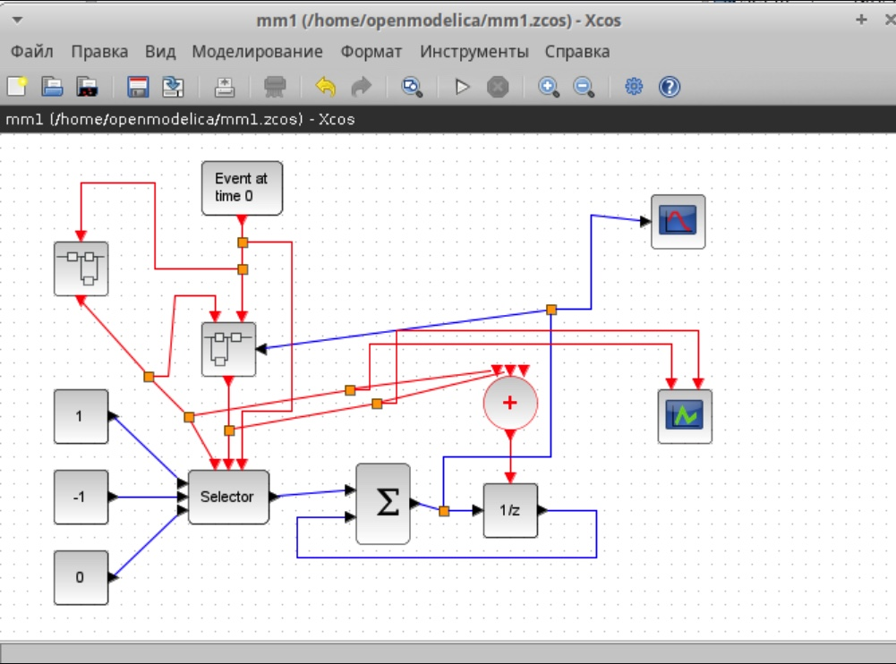
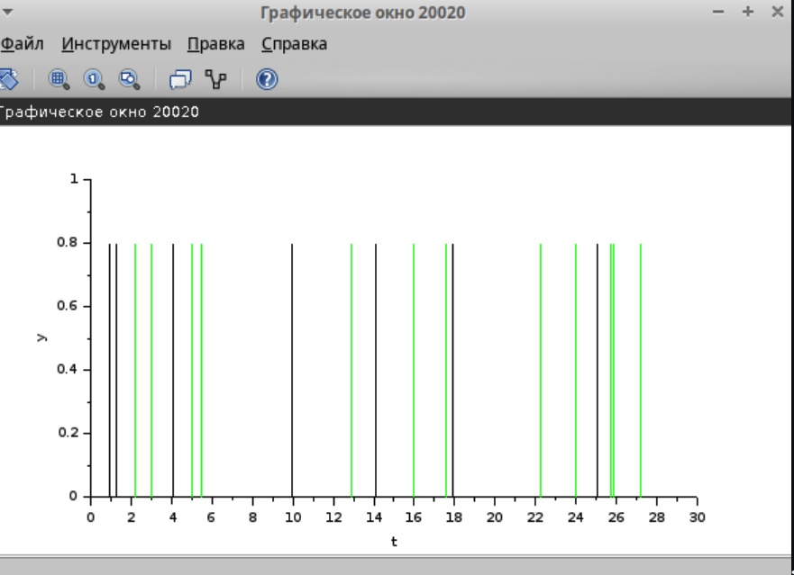
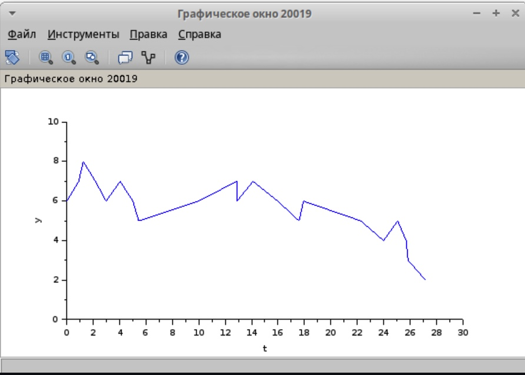

---
## Front matter
lang: ru-RU
title: Лабораторная работа 7
subtitle: Модель M|M|1|
author:
  - Оширова Ю. Н.
institute:
  - Российский университет дружбы народов, Москва, Россия

## i18n babel
babel-lang: russian
babel-otherlangs: english

## Formatting pdf
toc: false
toc-title: Содержание
slide_level: 2
aspectratio: 169
section-titles: true
theme: metropolis
header-includes:
 - \metroset{progressbar=frametitle,sectionpage=progressbar,numbering=fraction}
---

# Информация

## Докладчик

  * Оширова Юлия Николаевна
  * студентка группы НФИбд-01-22
  * Российский университет дружбы народов
  * [1132222843@pfur.ru](mailto:1132222843@pfur.ru)

## Цель работы

Рассмотреть пример моделирования в *xcos* системы массового обслуживания типа $M|M|1|\infty$.

## Задание

1. Реализовать модель системы массового обслуживания типа $M|M|1|\infty$;
2. Построить график поступления и обработки заявок;
3. Построить график динамики размера очереди.

## Выполнение лабораторной работы

{#fig:001 width=70%}

## Выполнение лабораторной работы

{#fig:002 width=50%}

## Выполнение лабораторной работы

{#fig:003 width=50%}

## Выполнение лабораторной работы

{#fig:004 width=50%}

## Выполнение лабораторной работы

{#fig:005 width=60%}

## Выполнение лабораторной работы

{#fig:006 width=50%}

## Выводы

В процессе выполнения данной лабораторной работы я рассмотрела пример моделирования в *xcos* системы массового обслуживания типа $M|M|1|\infty$.