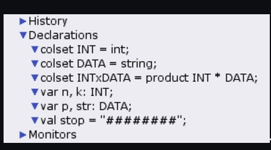

---
## Front matter
lang: ru-RU
title: Лабораторная работа №12
subtitle: Пример моделирования простого протокола передачи данных
author:
  - Оширова Ю. Н.
institute:
  - Российский университет дружбы народов, Москва, Россия

## i18n babel
babel-lang: russian
babel-otherlangs: english

## Formatting pdf
toc: false
toc-title: Содержание
slide_level: 2
aspectratio: 169
section-titles: true
theme: metropolis
header-includes:
 - \metroset{progressbar=frametitle,sectionpage=progressbar,numbering=fraction}
---

# Информация

## Докладчик

  * Оширова Юлия Николаевна
  * студентка группы НФИбд-01-22
  * Российский университет дружбы народов

## Цели и задачи

**Цель работы**

Реализовать простой протокол передачи данных в CPN Tools.

**Задание**

- Реализовать простой протокол передачи данных в CPN Tools.
- Вычислить пространство состояний, сформировать отчет о нем и построить граф.

## Выполнение лабораторной работы

{#fig:001 width=70%}

## Выполнение лабораторной работы

{#fig:002 width=60%}

## Выполнение лабораторной работы

{#fig:003 width=60%}

## Выполнение лабораторной работы

{#fig:004 width=70%}

## Выполнение лабораторной работы

{#fig:005 width=70%}

## Выполнение лабораторной работы

{#fig:006 width=70%}

## Упражнение

```
 Statistics
------------------------------------------------------------------------

  State Space
     Nodes:  13341
     Arcs:   206461
     Secs:   300
     Status: Partial

  Scc Graph
     Nodes:  6975
     Arcs:   170859
     Secs:   14
```

## Упражнение

```
 Boundedness Properties
------------------------------------------------------------------------

  Best Integer Bounds
                             Upper      Lower
     Main'A 1                20         0
     Main'B 1                10         0
     Main'C 1                6          0
     Main'D 1                5          0
     Main'NextRec 1          1          1
     Main'NextSend 1         1          1
     Main'Reciever 1         1          1
     Main'SA 1               1          1
     Main'SP 1               1          1
     Main'Send 1             8          8
```

## Упражнение

{#fig:007 width=70%}

## Выводы

В процессе выполнения данной лабораторной работы я реализовала простой протокол передачи данных в CPN Tools и проведен анализ его пространства состояний.